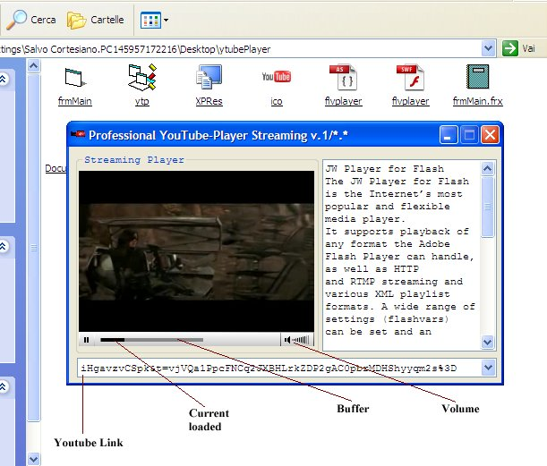



## How to use the JW Player for Flash to Play Youtube Video in streaming

### Description

JW Player for Flash! The JW Player for Flash is the Internet&#8217;s most popular and flexible media player. It supports playback of any format the Adobe Flash Player can handle, as well as HTTP

and RTMP streaming and various XML playlist formats. A wide range of settings (flashvars)

can be set and an extensive javascript API is available. The player's skinning functionality allows you to completely customize its look and its plugin architecture allows you to easily extend the player with features such as sharing, analytics and adserving.

For more info visit the URL:

http://developer.longtailvideo.com/trac

Source FLA:

http://developer.longtailvideo.com/trac/browser

Enjoy :)
 
### More Info
 

             |
---                |---
**Submitted On**   |2009-09-13 02:58:18
**By**             |[Salvo Cortesiano \(Italy\)](https://github.com/Planet-Source-Code/PSCIndex/blob/master/ByAuthor/salvo-cortesiano-italy.md)
**Level**          |Advanced
**User Rating**    |4.8 (19 globes from 4 users)
**Compatibility**  |VB 5\.0, VB 6\.0
**Category**       |[Coding Standards](https://github.com/Planet-Source-Code/PSCIndex/blob/master/ByCategory/coding-standards__1-43.md)
**World**          |[Visual Basic](https://github.com/Planet-Source-Code/PSCIndex/blob/master/ByWorld/visual-basic.md)
**Archive File**   |[How\_to\_use2162499142009\.zip](https://github.com/Planet-Source-Code/salvo-cortesiano-italy-how-to-use-the-jw-player-for-flash-to-play-youtube-video-in-streami__1-72455/archive/master.zip)

